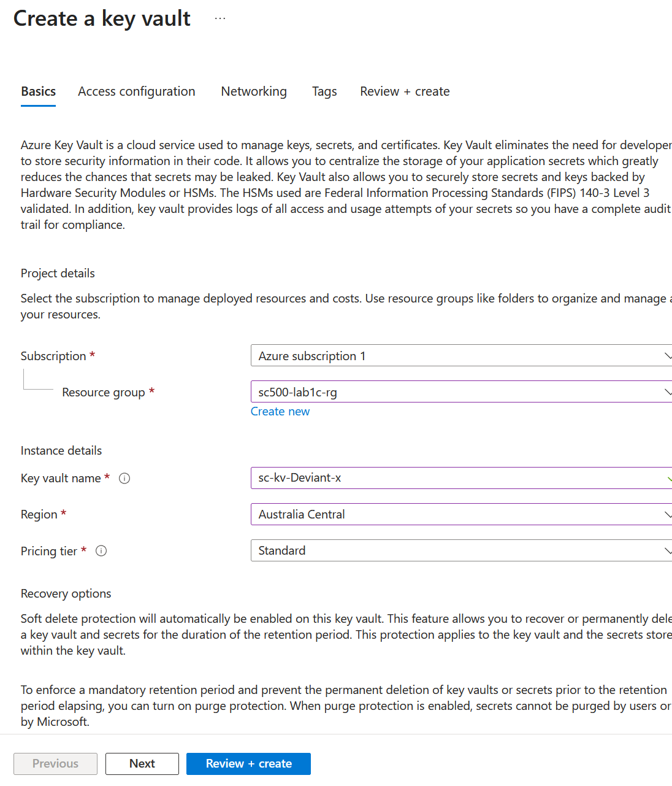
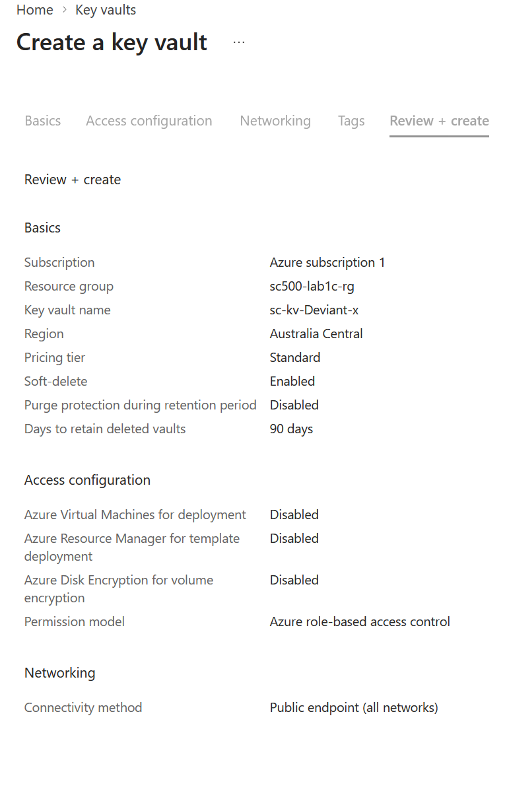
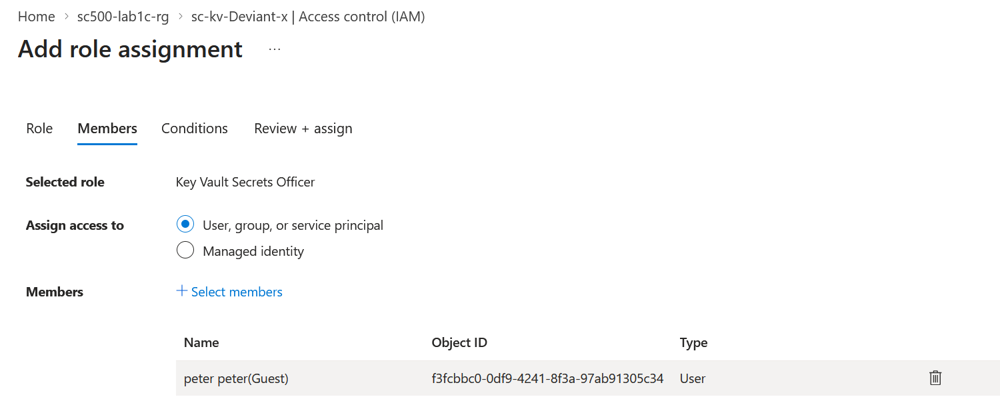
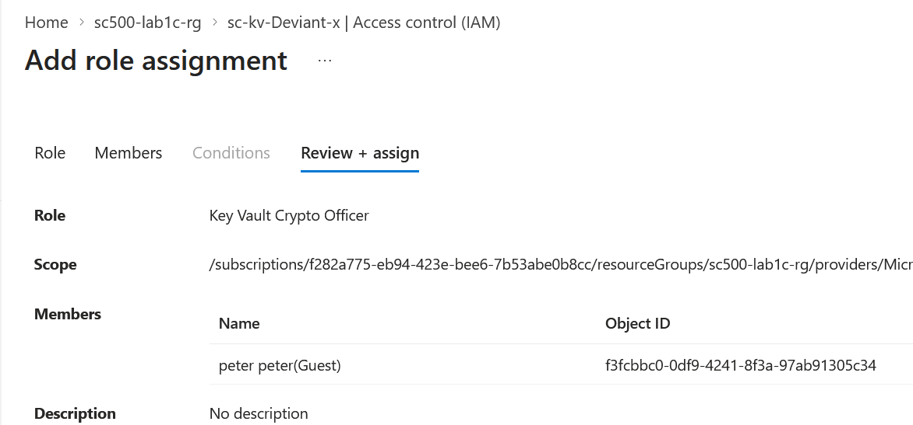
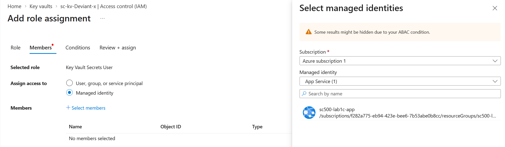
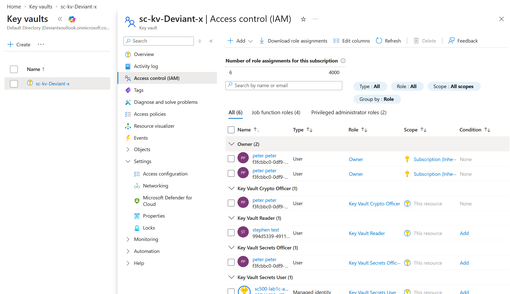
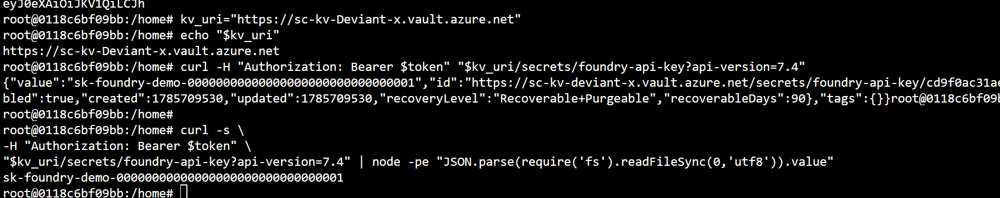
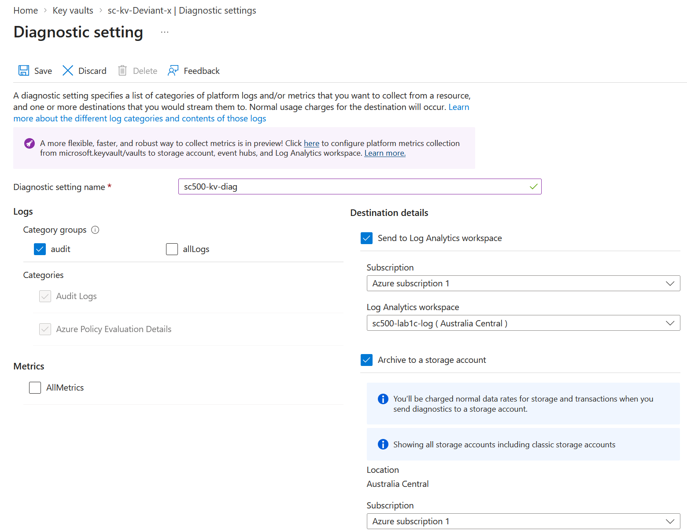
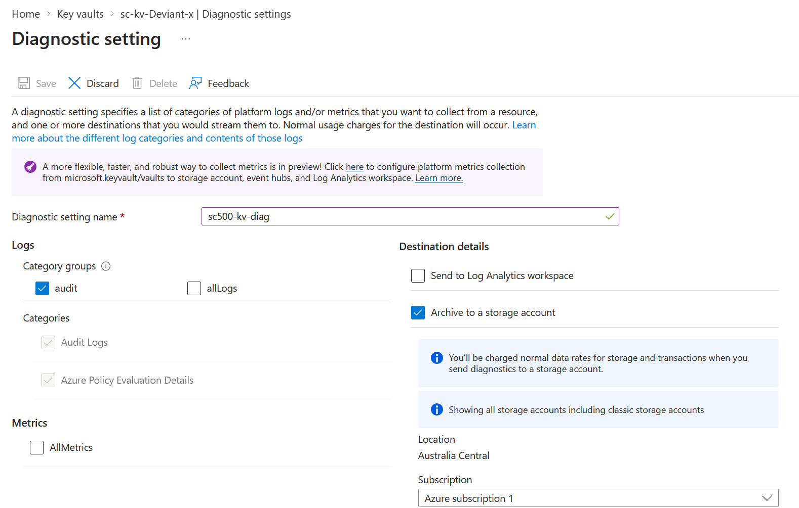

====================================================================
SC-500 LABPAGE RUNBOOK
Lab 1C – Deploy and Secure Azure Key Vault
Microsoft SC-500: Microsoft Identity and Access Administrator
====================================================================

# LAB OBJECTIVE

Deploy and secure Azure Key Vault to centrally manage application secrets using Azure RBAC, Managed Identity, Microsoft Defender for Cloud, Azure Monitor and Diagnostic Settings while implementing Microsoft's Zero Trust security principles.

---

# LAB SCENARIO

The application currently stores sensitive information inside configuration files.

As the Identity and Security Administrator, your objective is to eliminate embedded credentials by securely storing secrets inside Azure Key Vault. Access will be controlled through Microsoft Entra ID, Azure RBAC and Managed Identity so applications authenticate without usernames, passwords or connection strings.

At the completion of this lab you will have successfully:

* Deployed Azure Key Vault

* Configured Azure RBAC

* Stored application secrets

* Verified RBAC authorization

* Retrieved secrets using Managed Identity

* Restricted Key Vault network access

* Enabled Microsoft Defender for Cloud

* Configured Diagnostic Settings

---

# LAB ENVIRONMENT

Subscription

Azure subscription 1

Resource Group

sc500-lab1c-rg

Resources

* Azure Key Vault

* Azure App Service

* Managed Identity

* Azure RBAC

* Azure Virtual Network

* Microsoft Defender for Cloud

* Azure Monitor

* Log Analytics Workspace

====================================================================
TASK 1 — DEPLOY THE AZURE KEY VAULT
====================================================================

## Objective

Deploy a new Azure Key Vault that will securely store application secrets, cryptographic keys and certificates.

Azure Key Vault provides centralized secret management while integrating with Microsoft Entra ID for authentication and Azure RBAC for authorization.

---

## Step 1

Sign in to

https://portal.azure.com

Verify you are using

Azure subscription 1

Purpose

Access the Microsoft Learn lab subscription.

---

## Step 2

From the Azure Portal search bar

Search

Key Vaults

Select

Key Vaults

Select

+ Create

Purpose

Begin deployment of a new Azure Key Vault.

---

## Step 3

Configure the *Basics* tab.

| Setting | Value |
|---------|-------|
| Subscription | Azure subscription 1 |
| Resource Group | sc500-lab1c-rg |
| Key Vault Name | sc-kv-Deviant-x |
| Region | Same region as lab resources |
| Pricing Tier | Standard |

### Screenshot

Purpose

Deploy the secure vault that will contain application secrets.

---

## Step 4

Select the

*Access Configuration*

tab.

Choose

*Azure role-based access control (RBAC)*

instead of

*Vault access policy*

Purpose

Azure RBAC provides centralized authorization through Microsoft Entra ID and is Microsoft's recommended authorization model.

---

## Step 5

Continue through the remaining tabs without changing default settings unless instructed

Select

Review + Create

Verify all settings.

Select

Create

Wait until deployment completes successfully.

### Screenshot

Expected Result

Deployment completed successfully.

Validation

✓ Azure Key Vault deployed

✓ Azure RBAC authorization enabled

✓ Vault ready for configuration

====================================================================
TASK 2 — CONFIGURE ACCESS USING AZURE RBAC
====================================================================

## Objective

Grant least-privilege permissions using Azure RBAC.

Different administrators and applications should receive only the permissions required to perform their assigned responsibilities.

---

## Step 1

Open

sc-kv-Deviant-x

Navigate to

Access Control (IAM)

Purpose

Manage authorization using Azure RBAC.

---

## Step 2

Assign

Key Vault Secrets Officer

to

AzureAdministrator

### Screenshot

Purpose

Allows management of secrets while preventing unnecessary administrative permissions.

---

## Step 3

Assign

Key Vault Crypto Officer

to

AzureAdministrator

### Screenshot

Purpose

Allows administration of cryptographic keys stored within Azure Key Vault.

---

## Step 4

Assign

Key Vault Secrets User

to the Azure App Service Managed Identity.

### Screenshot

Purpose

Allows the application to retrieve secrets securely using Managed Identity without storing credentials.

---

## Step 5

Review all assigned roles.

### Screenshot

Expected Result

Required Azure RBAC roles successfully assigned.

Validation

✓ Least privilege implemented

============
TASK 3 — STORE SECRETS AND KEYS
====================================================================

## Objective

Store application secrets inside Azure Key Vault to eliminate hard-coded credentials from application configuration files.

Azure Key Vault securely stores sensitive information and makes it available only to authorized identities.

---

## Step 1

Open

sc-kv-Deviant-x

Navigate to

Objects

Secrets

Purpose

Open the secret management section of Azure Key Vault.

---

## Step 2

Select

+ Generate/Import

Configure

| Setting | Value |
|----------|-------|
| Upload Options | Manual |
| Name | foundry-api-key |
| Secret Value | Lab provided value |

Purpose

Create the application secret that will later be retrieved using Managed Identity.

---

## Step 3

Select

Create

Expected Result

The secret appears inside the Key Vault.

Validation

✓ Secret successfully created.

✓ Secret stored securely inside Azure Key Vault.

====================================================================
TASK 4 — VERIFY ACCESS CONTROL ENFORCEMENT
====================================================================

## Objective

Verify that Azure RBAC correctly controls access to Azure Key Vault resources.

Only users with the appropriate roles should be able to manage or retrieve secrets.

---

## Step 1

Review the Azure RBAC assignments configured for the Key Vault.

Confirm the following assignments exist.

| Principal | Role |
|------------|------|
| AzureAdministrator | Key Vault Secrets Officer |
| AzureAdministrator | Key Vault Crypto Officer |
| App Service Managed Identity | Key Vault Secrets User |

Purpose

Verify that least-privilege permissions have been correctly implemented.

---

## Step 2

Attempt to access Key Vault using identities without the required permissions.

Observe that Azure RBAC blocks unauthorized operations.

Purpose

Validate that Azure RBAC enforcement is functioning correctly.

Expected Result

Unauthorized identities cannot retrieve or manage Key Vault secrets.

Validation

✓ Azure RBAC successfully enforcing authorization.

✓ Least privilege confirmed.

====================================================================
TASK 5 — RETRIEVE A SECRET USING MANAGED IDENTITY
====================================================================

## Objective

Use the Azure App Service Managed Identity to authenticate to Azure Key Vault and retrieve the stored application secret without using usernames, passwords or connection strings.

---

## Step 1

Open

Azure Cloud Shell

Select

Bash

Purpose

Execute Azure REST API commands.

---

## Step 2

Generate an OAuth access token using the Managed Identity.

bash
token_response=$(curl -s 'http://169.xxx.xxx.xxx/metadata/identity/oauth2/token?resource=https://vault.azure.net&api-version=2018-02-01' -H Metadata:true)

Purpose

Request an Azure AD access token for Azure Key Vault.

---

## Step 3

Extract the Bearer token.

bash
token=$(echo "$token_response" | node -pe "JSON.parse(require('fs').readFileSync(0,'utf8')).access_token")

Purpose

Extract the access token from the JSON response.

---

## Step 4

Verify that the token was successfully generated.

bash
echo "$token" | cut -c1-20

Expected Result

The command displays the first twenty characters of the access token.

Purpose

Confirm successful authentication.

---

## Step 5

Define the Azure Key Vault URI.

bash
kv_url="https://sc-kv-Deviant-x.vault.azure.net"

Verify

bash
echo "$kv_url"

Expected Result

https://sc-kv-Deviant-x.vault.azure.net

---

## Step 6

Retrieve the stored secret.

bash
curl -s \
-H "Authorization: Bearer $token" 
"$kv_url/secrets/foundry-api-key?api-version=7.4" 
| node -pe "JSON.parse(require('fs').readFileSync(0,'utf8')).value"

### Screenshot

Expected Result

sk-foundry-demo-0000000000000000000000001

Purpose

Demonstrate passwordless authentication using Managed Identity.

Validation

✓ Managed Identity authenticated successfully.

✓ Azure RBAC authorization successful.

✓ Secret successfully retrieved from Azure Key Vault

TASK 6 — RESTRICT NETWORK ACCESS TO AZURE KEY VAULT
====================================================================

## Objective

Restrict Azure Key Vault access so that only approved Azure Virtual Networks can communicate with the vault while blocking unauthorized network traffic.

This provides an additional layer of security beyond Azure RBAC by enforcing network-based access controls.

---

## Step 1

Open

sc-kv-Deviant-x

Navigate to

Networking

Purpose

Configure firewall and virtual network access rules for Azure Key Vault.

---

## Step 2

Under

Firewall and virtual networks

Select

*Allow public access from specific virtual networks and IP addresses*

Purpose

Restrict public access and allow communication only from approved networks.

---

## Step 3

Under

Virtual Networks

Select

*+ Add existing virtual network*

Configure

| Setting | Value |
|----------|-------|
| Subscription | Azure subscription 1 |
| Virtual Network | sc500-lab1c-vnet |
| Subnet | default |

Select

Add

Purpose

Allow Azure resources inside the approved Virtual Network to communicate with Azure Key Vault.

---

## Step 4

Under

Exceptions

Verify

*Allow trusted Microsoft services to bypass this firewall*

is enabled.

Purpose

Allows trusted Azure platform services to securely communicate with Azure Key Vault.

---

## Step 5

Select

Apply

Expected Result

The Key Vault networking configuration is successfully updated.

Validation

✓ Firewall enabled.

✓ Virtual Network restriction configured.

✓ Trusted Microsoft Services exception enabled.

====================================================================
TASK 7 — ENABLE MICROSOFT DEFENDER FOR KEY VAULT
====================================================================

## Objective

Enable Microsoft Defender for Cloud to continuously monitor Azure Key Vault for security threats, suspicious behavior and security recommendations.

---

## Step 1

Open

Microsoft Defender for Cloud

Purpose

Access Azure's cloud security posture management solution.

---

## Step 2

Navigate to

Management

Environment settings

Purpose

Configure Microsoft Defender plans for the Azure subscription.

---

## Step 3

Select

Azure subscription 1

Purpose

Open the Defender configuration for the lab subscription.

---

## Step 4

Open

Defender Plans

Purpose

View all Microsoft Defender plans available for Azure resources.

---

## Step 5

Locate

Key Vault

Change

Status

OFF

to

ON

### Screenshot

Purpose

Enable continuous threat detection for Azure Key Vault.

Microsoft Defender monitors for:

* Suspicious secret access

* Unusual authentication attempts

* Credential harvesting attempts

* Malicious IP addresses

* Abnormal secret retrieval behavior

---

## Step 6

Select

Save

Expected Result

Notification

Key Vault plan in subscription "Azure subscription 1" saved successfully.

Validation

✓ Microsoft Defender for Key Vault enabled.

✓ Threat protection configured.

====================================================================
TASK 8 — CONFIGURE DIAGNOSTIC SETTINGS
====================================================================

## Objective

Configure Azure Monitor Diagnostic Settings so Key Vault audit logs are forwarded to Azure Monitor Log Analytics for centralized monitoring, investigation and compliance reporting.

---

## Step 1

Open

sc-kv-Deviant-x

Navigate to

Monitoring

Diagnostic Settings

Purpose

Configure Azure Monitor integration.

---

## Step 2

Select

+ Add diagnostic setting

Purpose

Create a new diagnostic configuration.

---

## Step 3

Configure

| Setting | Value |
|----------|-------|
| Diagnostic Setting Name | sc500-kv-diag |
| Category Group | audit |
| Destination | Send to Log Analytics workspace |
| Subscription | Azure subscription 1 |
| Log Analytics Workspace | sc500-lab1c-log |

### Screenshot

Purpose

Forward Key Vault audit events to Azure Monitor Log Analytics for centralized monitoring and security investigations.

---

## Step 4

Select

Save

Expected Result

Successfully updated diagnostics for sc-kv-Deviant-x

Validation

✓ Diagnostic Settings configured successfully.

✓ Audit logs forwarded to Azure Monitor Log Analytics.

SECURITY CONCEPTS DEMONSTRATED
====================================================================

This lab demonstrated the implementation of Microsoft's recommended security controls for protecting sensitive application secrets using Azure Key Vault.

### Identity Security

* Microsoft Entra ID Authentication

* Azure Managed Identity

* Passwordless Authentication

* OAuth Bearer Token Authentication

### Authorization

* Azure Role-Based Access Control (Azure RBAC)

* Least Privilege Access

* Separation of Duties

### Secrets Management

* Azure Key Vault

* Secret Management

* Secure Secret Retrieval

* Centralized Secret Storage

### Network Security

* Azure Key Vault Firewall

* Virtual Network Restrictions

* Trusted Microsoft Services

### Threat Protection

* Microsoft Defender for Cloud

* Defender for Key Vault

* Continuous Threat Detection

### Monitoring

* Azure Monitor

* Diagnostic Settings

* Log Analytics Workspace

* Audit Logging

====================================================================
LAB VALIDATION CHECKLIST
====================================================================

Deployment

☑️ Azure Key Vault successfully deployed.

☑️ Azure RBAC selected as the authorization model.

☑️ Azure Key Vault accessible from Azure Portal.

--------------------------------------------------------------------

Azure RBAC

☑️ Key Vault Secrets Officer assigned.

☑️ Key Vault Crypto Officer assigned.

☑️ Key Vault Secrets User assigned.

☑️ Least privilege implemented.

--------------------------------------------------------------------

Secret Management

☑️ Secret successfully stored inside Azure Key Vault.

☑️ Secret protected using Azure RBAC.

☑️ Unauthorized access prevented.

--------------------------------------------------------------------

Managed Identity

☑️ Managed Identity enabled.

☑️ OAuth access token generated.

☑️ Azure AD authentication successful.
